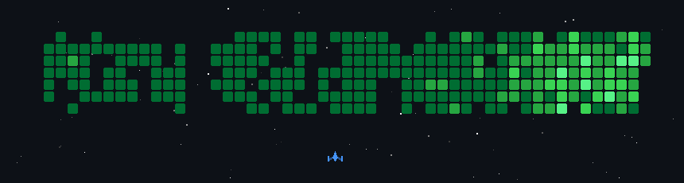

<h1 align="center">Ben</h1>
<h3 align="center">Fullstack Developer</h3>

<!--

  I see software development not just as a sequence of functions, but as the creation of digital ecosystems. 
  As a Fullstack Developer, I move fluently between worlds: from the precise logic of robust backend architectures 
  to the subtle details of intuitive user interfaces. My focus is always on the symbiosis of scalability and 
  elegance – designing systems that don't just withstand load, but convince through their clarity and long-term 
  maintainability.

  Instead of patching isolated symptoms, I look at the system as a whole. I question inherited constraints 
  and design solutions from first principles. Whether it's crafting high-availability APIs, weaving 
  event-driven integrations, or orchestrating infrastructure that breathes with the application – I strive 
  for solutions that scale cleanly, stay understandable under pressure, and remain a joy to maintain.

-->

  
Core stack

  

    
    
    
    
    
    
    
    
    
    
    
    
    
    
    
    
    
    
    
    
    
    
  

  
GitHub activity

  

    
  

  

    
  

  

    
  

<!--

  Clean architecture, security-aware design, and the continuous pursuit of systems that remain resilient as traffic, complexity, and teams grow.

-->